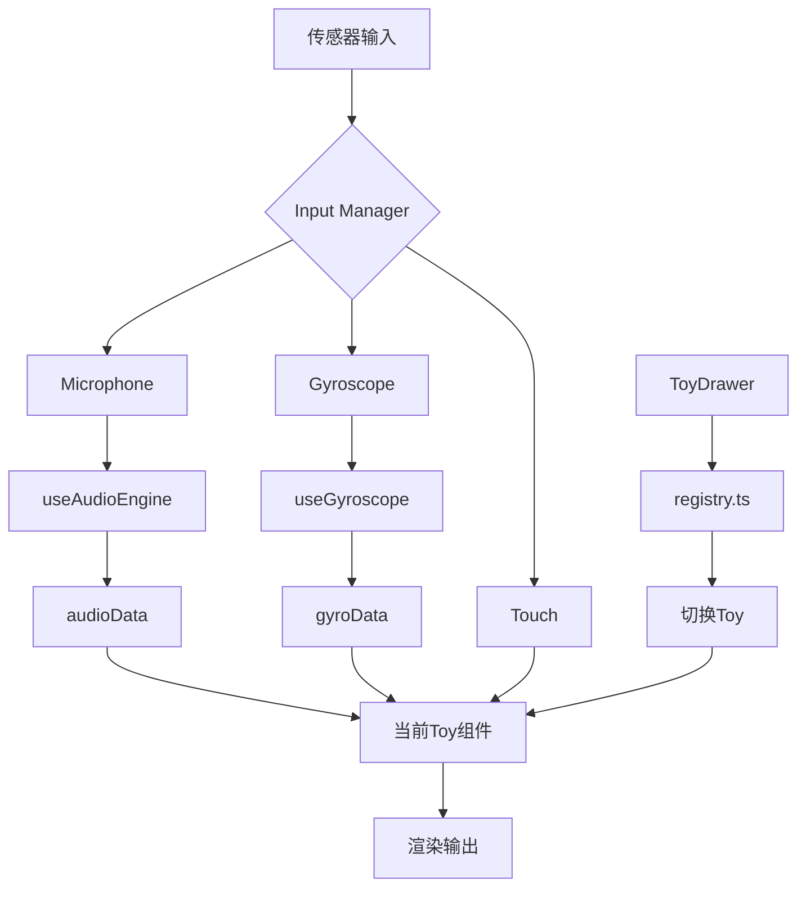

# Bored 架构设计文档

> **标签**: #architecture #react #threejs #plugin-system
> **创建日期**: 2025-12-05
> **版本**: 1.0.0

---

## 概述

**Bored** 是一个基于插件化架构的横屏挂机玩具沙盒应用。核心设计理念是**零配置添加新游戏**，支持频繁快速上新。

## 核心设计原则

1. **插件化** - 每个玩具都是独立的插件，互不干扰
2. **约定优于配置** - 标准化接口，减少样板代码
3. **传感器抽象** - 统一管理麦克风、陀螺仪、触摸等输入
4. **类型安全** - TypeScript全覆盖，编译时捕获错误

---

## 目录结构

```
src/
├── core/                       # 🔧 核心基础设施层
│   ├── types.ts                # 类型定义（ToyConfig, ToyProps等）
│   ├── sensors/                # 传感器抽象
│   │   └── useGyroscope.ts     # 陀螺仪Hook
│   └── storage/                # 持久化存储
│       └── usePreferences.ts   # 用户偏好管理
│
├── toys/                       # 🎮 玩具/游戏层（插件）
│   ├── registry.ts             # ** 玩具注册表（核心！）**
│   ├── FluidDream.tsx          # 流体梦境（2D Canvas）
│   ├── NeonFire.tsx            # 霓虹火焰（2D Canvas）
│   ├── CubeTest.tsx            # 低音方块（3D R3F）
│   ├── TouchFlow.tsx           # 粒子流体（3D GPGPU）
│   └── wave-bottle/            # 晃动小船（3D 交互）
│       └── WaveBottle.tsx
│
├── ui/                         # 🎨 全局UI组件
│   ├── LaunchScreen.tsx        # 启动屏
│   └── ToyDrawer.tsx           # 玩具选择抽屉
│
├── components/                 # 🏗️ 公共组件
│   └── stage/                  # 3D舞台（R3F Canvas配置）
│       └── Stage.tsx
│
├── hooks/                      # 🪝 React Hooks
│   └── useAudioEngine.ts       # 音频分析引擎
│
└── App.tsx                     # 🚪 应用入口
```

---

## 架构分层

### Layer 1: Core 层（基础设施）

#### [[ToyConfig]] 接口
所有玩具必须遵循的标准配置格式：

```typescript
interface ToyConfig {
  id: string;                // 唯一标识符（kebab-case）
  name: string;              // 显示名称
  icon: string;              // emoji图标
  description: string;       // 简短描述
  category: 'ambient' | 'interactive';  // 类别
  type: '2d' | '3d';        // 渲染类型
  inputs?: {                 // 需要的输入源
    gyroscope?: boolean;
    microphone?: boolean;
    touch?: boolean;
  };
  component: React.FC<ToyProps>;  // 主组件
  settingsComponent?: React.FC;    // 可选设置面板
}
```

#### [[ToyProps]] 接口
所有玩具组件接收的Props：

```typescript
interface ToyProps {
  data: any;           // 传感器数据
  events?: any[];      // 离散事件
  isActive: boolean;   // 激活状态
}
```

### Layer 2: Toys 层（插件）

#### 注册机制

**核心文件**: `toys/registry.ts`

```typescript
export const TOY_REGISTRY: Record<string, ToyConfig> = {
  'wave-bottle': {
    id: 'wave-bottle',
    name: 'Wave Bottle',
    icon: '🚢',
    description: '晃动小船水晶玩具',
    category: 'interactive',
    type: '3d',
    inputs: { gyroscope: true },
    component: WaveBottle,
  },
  // ... 其他玩具
};
```

#### 玩具分类

| 类别 | 说明 | 示例 |
|-----|------|-----|
| **ambient** | 环境型（观赏）| 粒子流体、火焰 |
| **interactive** | 交互型（需操作）| 晃动小船 |

#### 渲染类型

| 类型 | 技术栈 | 用途 |
|-----|--------|-----|
| **2d** | HTML Canvas 2D | 像素艺术、流体 |
| **3d** | React Three Fiber | 3D场景、AR |

---

## 数据流



---

## 核心流程

### 1. 应用启动流程

```
1. LaunchScreen 显示 (1秒)
   ↓
2. 读取 localStorage (usePreferences)
   ↓
3. 加载上次玩的玩具ID
   ↓
4. 从 registry 获取 ToyConfig
   ↓
5. 注入所需传感器数据
   ↓
6. 渲染 Toy 组件
```

### 2. 切换玩具流程

```
用户点击抽屉按钮
   ↓
ToyDrawer 打开
   ↓
显示所有注册的玩具（从 registry）
   ↓
用户选择新玩具
   ↓
保存到 localStorage
   ↓
App.tsx 切换组件
   ↓
卸载旧组件 → 挂载新组件
```

### 3. 传感器数据注入

```typescript
// App.tsx 中的逻辑
const currentToy = getToy(currentToyId);

// 根据 inputs 配置自动注入
const sensorData = {
  ...(currentToy.inputs?.microphone ? audioData : {}),
  ...(currentToy.inputs?.gyroscope ? gyroData : {}),
};

<CurrentToyComponent data={sensorData} isActive={isStarted} />
```

---

## 添加新玩具指南

### 步骤 1: 创建组件

在 `src/toys/` 下创建文件夹：

```tsx
// src/toys/my-game/MyGame.tsx
import React from 'react';
import { ToyProps } from '../../core/types';

const MyGame: React.FC<ToyProps> = ({ data, isActive }) => {
  // 游戏逻辑
  return <group>{/* Three.js 场景 */}</group>;
};

export default MyGame;
```

### 步骤 2: 注册到系统

```diff
// src/toys/registry.ts
import MyGame from './my-game/MyGame';

export const TOY_REGISTRY: Record<string, ToyConfig> = {
+  'my-game': {
+    id: 'my-game',
+    name: 'My Game',
+    icon: '🎯',
+    description: '我的新游戏',
+    category: 'interactive',
+    type: '3d',
+    inputs: {
+      gyroscope: true,
+      touch: true,
+    },
+    component: MyGame,
+  },
};
```

### 步骤 3: 完成！

重启开发服务器，新游戏自动出现在抽屉中。

---

## 技术栈详解

### 前端框架
- **React 19** - UI框架
- **TypeScript** - 类型系统
- **Vite** - 构建工具

### 3D渲染
- **Three.js** - WebGL引擎
- **React Three Fiber** - React声明式3D
- **@react-three/drei** - 工具库
- **@react-three/xr** - AR/VR支持

### 移动端
- **Capacitor** - 跨平台打包
- **@capacitor-community/keep-awake** - 保持屏幕常亮

### 样式
- **Tailwind CSS** - 实用样式（CDN）

---

## 传感器系统

### 陀螺仪 (`useGyroscope`)

```typescript
const gyroData = useGyroscope(isActive);

// 返回：
{
  tilt: { x: number, y: number },  // -1 到 1
  shake: number                     // 0 到 1
}
```

**实现原理**:
- Web: `DeviceOrientationEvent` + `DeviceMotion`
- iOS: 需要请求权限
- Android: 自动可用

### 麦克风 (`useAudioEngine`)

```typescript
const { audioData, recentEvents } = useAudioEngine();

// audioData 包含:
{
  bass: number,    // 低音能量
  mid: number,     // 中音能量
  high: number,    // 高音能量
  energy: number,  // 总能量
  vol: number,     // 音量
}
```

**实现原理**:
- Web Audio API
- FFT分析
- 频段分离

---

## 性能优化

### 1. 组件懒加载
```typescript
// ❌ 不要这样（所有玩具立即加载）
import AllToys from './toys';

// ✅ 推荐（按需加载）
const activeToy = getToy(currentId);
<activeToy.component />
```

### 2. Canvas分离
- 3D玩具：独立 R3F Canvas（硬件加速）
- 2D玩具：独立 HTML Canvas（低开销）

### 3. 传感器节流
```typescript
// useGyroscope内部
if (timeDelta > 0.05) {  // 限制20fps更新
  updateData();
}
```

---

## 横屏适配

### HTML层
```html
<meta name="screen-orientation" content="landscape" />
```

### Capacitor层
```typescript
// capacitor.config.ts
android: {
  allowMixedContent: true,
}
```

### Android层
```xml
<!-- AndroidManifest.xml -->
<activity
  android:screenOrientation="landscape"
  ...
/>
```

---

## 本地存储

### 数据结构
```typescript
interface UserPreferences {
  lastToyId: string | null;
  toySettings: Record<string, any>;
}
```

### 存储Key
```
localStorage['bored_preferences']
```

### 使用示例
```typescript
const { setLastToyId, getToySettings } = usePreferences();

// 保存上次玩的游戏
setLastToyId('wave-bottle');

// 读取游戏设置（如选择的皮肤）
const settings = getToySettings('wave-bottle');
```

---

## 扩展点

### 1. 添加新传感器
在 `core/sensors/` 创建新Hook：

```typescript
// useMagnetometer.ts
export const useMagnetometer = (enabled: boolean) => {
  // 磁力计逻辑
  return { heading, strength };
};
```

### 2. 添加玩具设置面板
```typescript
// toys/wave-bottle/BoatSelector.tsx
const BoatSelector: React.FC = () => {
  return <div>选择小船皮肤</div>;
};

// 注册时添加
{
  settingsComponent: BoatSelector,
}
```

### 3. 添加全局后处理
在 `Stage.tsx` 中添加：

```tsx
<EffectComposer>
  <Bloom />
  <ChromaticAberration />
</EffectComposer>
```

---

## 常见问题

### Q: 如何调试某个玩具？
**A**: 修改 `registry.ts` 中的 `DEFAULT_TOY_ID`：
```typescript
export const DEFAULT_TOY_ID = 'wave-bottle'; // 改成你要调试的玩具ID
```

### Q: 如何禁用某个玩具？
**A**: 在 `registry.ts` 中注释掉对应条目即可。

### Q: 2D和3D玩具能共存吗？
**A**: 不能。同一时间只能运行一个玩具。

### Q: 如何添加多点触控？
**A**: 使用 `@react-three/fiber` 的 `onPointerMove` 事件。

---

## 相关文档

- [[Project_Roadmap]] - 项目路线图
- [[Project_Structure]] - 旧版结构（已废弃）
- [[README]] - 快速开始指南

---

## 版本历史

| 版本 | 日期 | 变更 |
|-----|------|-----|
| 1.0.0 | 2025-12-05 | 初始版本，完成架构改造 |

---

**维护者**: Bored Team
**最后更新**: 2025-12-05
